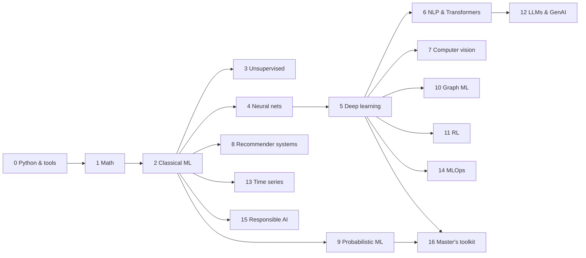

# Machine Learning Learning Path — from zero to advanced

A step-by-step route through the vault. Each stage lists **what to learn**, **the notes in this vault**, **external resources (with links)**, a **project**, and a **checkpoint**. Tick boxes as you go.

> [!tip] Pace
> Roughly 2–4 weeks per stage part-time. Stages 0–5 are the core every ML person needs; 6+ can be taken in any order depending on your interest.

---

## Stage 0 — Python & tooling
- [ ] Python, NumPy, pandas, matplotlib, Jupyter
- Vault: [[NumPy Snippets]], [[Tools and Libraries]]
- Resources: [Kaggle Learn – Python, Pandas, Intro to ML](https://www.kaggle.com/learn) · [NumPy docs](https://numpy.org/doc/stable/) · [pandas getting started](https://pandas.pydata.org/docs/getting_started/index.html) · [Google Colab](https://colab.research.google.com/)
- Project: clean and visualise a Kaggle dataset.
- Checkpoint: vectorise a loop in NumPy; group-by + plot in pandas.

## Stage 1 — Math foundations
- [ ] Linear algebra, calculus, probability, optimisation
- Vault: [[Linear Algebra for ML]] · [[Calculus and Optimization]] · [[Probability for ML]] · [[Information Theory]] · [[Gradient Descent]] · [[Matrix Calculus Cheatsheet]]
- Resources: [Mathematics for Machine Learning (free book)](https://mml-book.github.io/) · [3Blue1Brown – Essence of Linear Algebra](https://www.3blue1brown.com/lessons/eola-preview/) · [3Blue1Brown – Calculus](https://www.3blue1brown.com/lessons/essence-of-calculus/) · [MIT 18.06 Linear Algebra (Strang)](https://ocw.mit.edu/courses/18-06-linear-algebra-spring-2010/) · [StatQuest videos](https://statquest.org/video_index.html)
- Checkpoint: derive $\nabla_w\lVert Xw-y\rVert^2$; explain eigenvectors and Bayes' rule.

## Stage 2 — Classical supervised learning
- [ ] Regression, classification, trees, ensembles, SVMs, evaluation
- Vault: [[What is Machine Learning]] · [[Learning Paradigms]] · [[Linear Regression]] · [[Logistic Regression]] · [[Linear Models for Classification]] · [[Naive Bayes]] · [[k-Nearest Neighbors]] · [[Decision Trees]] · [[Ensemble Methods]] · [[Support Vector Machines]] · [[Kernel Methods]] · [[Bias-Variance Tradeoff]] · [[Overfitting and Regularization]] · [[Model Evaluation and Metrics]] · [[Cross-Validation and Model Selection]] · [[Feature Engineering]] · [[Data Preprocessing]] · [[ML Workflow]]
- Resources: [Machine Learning Specialization – Andrew Ng](https://www.coursera.org/specializations/machine-learning-introduction) · [An Introduction to Statistical Learning (free, Python edition)](https://www.statlearning.com/) · [Stanford CS229](https://cs229.stanford.edu/) · [scikit-learn user guide](https://scikit-learn.org/stable/user_guide.html) · [Google ML Crash Course](https://developers.google.com/machine-learning/crash-course)
- Project: Titanic / house prices end-to-end with a pipeline + CV ([[scikit-learn Recipes]]).
- Checkpoint: explain bias–variance, precision/recall, why boosting beats a single tree.

## Stage 3 — Unsupervised learning
- [ ] Clustering, PCA, mixtures, anomaly detection
- Vault: [[Clustering]] · [[Dimensionality Reduction]] · [[PCA]] · [[Gaussian Mixture Models and EM]] · [[Anomaly Detection]]
- Resources: [ISL ch. 12](https://www.statlearning.com/) · [scikit-learn clustering guide](https://scikit-learn.org/stable/modules/clustering.html) · [Bishop PRML (free PDF) ch. 9 & 12](https://www.microsoft.com/en-us/research/publication/pattern-recognition-machine-learning/)
- Project: customer segmentation with PCA + k-means.
- Checkpoint: run one EM step for a GMM by hand.

## Stage 4 — Neural networks from scratch
- [ ] Perceptron → MLP → backprop → optimisers
- Vault: [[Neural Networks]] · [[Backpropagation]] · [[Activation Functions]] · [[Optimizers]]
- Resources: [3Blue1Brown – Neural Networks](https://www.3blue1brown.com/topics/neural-networks) · [Michael Nielsen – Neural Networks and Deep Learning (free)](http://neuralnetworksanddeeplearning.com/) · [Karpathy – Neural Networks: Zero to Hero](https://karpathy.ai/zero-to-hero.html)
- Project: build *micrograd* and an MNIST MLP in NumPy.
- Checkpoint: forward + backward pass of a 2-layer net on paper.

## Stage 5 — Deep learning
- [ ] PyTorch, CNNs, RNNs, Transformers, training tricks, generative models
- Vault: [[CNN]] · [[RNN and LSTM]] · [[Attention Mechanism]] · [[Transformers]] · [[Self-Supervised and Contrastive Learning]] · [[Generative Models]] · [[Training Tricks]] · [[PyTorch Recipes]]
- Resources: [MIT 6.S191 — Introduction to Deep Learning (lecture playlist)](https://www.youtube.com/playlist?list=PLtBw6njQRU-rwp5__7C0oIVt26ZgjG9NI) · [course site & labs](https://introtodeeplearning.com/) · [Dive into Deep Learning (free, interactive)](https://d2l.ai/) · [Deep Learning book – Goodfellow et al. (free)](https://www.deeplearningbook.org/) · [Understanding Deep Learning – Prince (free)](https://udlbook.github.io/udlbook/) · [fast.ai Practical Deep Learning](https://course.fast.ai/) · [Deep Learning Specialization](https://www.coursera.org/specializations/deep-learning) · [PyTorch tutorials](https://pytorch.org/tutorials/)
- Project: fine-tune a pretrained ResNet on your own image classes.
- Checkpoint: explain residual connections, attention, and why AdamW.

## Stage 6 — NLP
- Vault: [[NLP Overview]] · [[Text Representations]] · [[Attention Mechanism]] · [[Transformers]]
- Resources: [Stanford CS224n](https://web.stanford.edu/class/cs224n/) · [Jurafsky & Martin – Speech and Language Processing (free draft)](https://web.stanford.edu/~jurafsky/slp3/) · [Hugging Face LLM Course](https://huggingface.co/learn/llm-course/chapter1/1) · [The Illustrated Transformer](https://jalammar.github.io/illustrated-transformer/)

## Stage 7 — Computer vision
- Vault: [[Computer Vision Overview]] · [[CNN]] · [[CNN Architectures]] · [[Object Detection]] · [[Image Segmentation]]
- Resources: [Stanford CS231n](https://cs231n.stanford.edu/) · [CS231n notes](https://cs231n.github.io/) · [torchvision](https://pytorch.org/vision/stable/index.html)

## Stage 8 — Recommender systems
- Vault: [[Recommender Systems Overview]] · [[Collaborative Filtering and Matrix Factorization]] · [[Content-Based and Hybrid Recommenders]] · [[Deep Learning Recommenders]] · [[Evaluating Recommenders]] · [[Multimodal Recommender Systems]] · [[Recommender Systems Resources]]
- Resources: [Google – Recommendation Systems course](https://developers.google.com/machine-learning/recommendation) · [Mining of Massive Datasets ch. 9 (free)](http://www.mmds.org/) · [D2L – Recommender Systems chapter](https://d2l.ai/chapter_recommender-systems/index.html)
- Project: [[Project - MovieLens Recommender]] (popularity → MF → BPR → two-tower → posters), then a multimodal one on [Amazon Reviews 2023](https://amazon-reviews-2023.github.io/) with [MMRec](https://github.com/enoche/MMRec).

## Stage 9 — Probabilistic ML & Bayesian methods
- Vault: [[Bayesian Inference]] · [[Probabilistic Graphical Models]] · [[Variational Inference]] · [[MCMC]] · [[Gaussian Processes]]
- Resources: [Murphy – Probabilistic Machine Learning (free)](https://probml.github.io/pml-book/) · [Bishop PRML](https://www.microsoft.com/en-us/research/publication/pattern-recognition-machine-learning/) · [Statistical Rethinking](https://github.com/rmcelreath/stat_rethinking_2024) · [PyMC docs](https://www.pymc.io/)

## Stage 10 — Graph ML
- Vault: [[Graph ML Overview]] · [[Link Prediction]] · [[Graph Neural Networks]]
- Resources: [Stanford CS224W](https://web.stanford.edu/class/cs224w/) · [Hamilton – Graph Representation Learning (free)](https://www.cs.mcgill.ca/~wlh/grl_book/) · [PyTorch Geometric](https://pytorch-geometric.readthedocs.io/)

## Stage 11 — Reinforcement learning
- Vault: [[RL Basics and MDPs]] · [[Q-Learning and Policy Gradients]]
- Resources: [Sutton & Barto (free)](http://incompleteideas.net/book/the-book-2nd.html) · [David Silver RL course](https://www.davidsilver.uk/teaching/) · [OpenAI Spinning Up](https://spinningup.openai.com/) · [Gymnasium](https://gymnasium.farama.org/)

## Stage 12 — LLMs & generative AI
- Vault: [[LLMs Overview]] · [[Fine-tuning and Alignment]] · [[RAG and Agents]] · [[Generative Models]]
- Resources: [Karpathy – Let's build GPT](https://karpathy.ai/zero-to-hero.html) · [Hugging Face LLM Course](https://huggingface.co/learn/llm-course/chapter1/1) · [Lilian Weng's blog](https://lilianweng.github.io/)

## Stage 13 — Time series
- Vault: [[Time Series Forecasting]] · [[Classical Forecasting Models]] · [[Time Series Validation and Features]] · [[Deep Learning for Time Series]]
- Resources: [Hyndman – Forecasting: Principles and Practice (free)](https://otexts.com/fpp3/)

## Stage 14 — MLOps & production
- Vault: [[MLOps Overview]] · [[Model Deployment and Serving]] · [[Experiment Tracking and Reproducibility]] · [[Data and Feature Management]] · [[Common Pitfalls]]
- Resources: [Made With ML](https://madewithml.com/) · [Stanford CS329S – ML Systems Design](https://stanford-cs329s.github.io/) · [Full Stack Deep Learning](https://fullstackdeeplearning.com/course/)

## Stage 15 — Responsible AI
- Vault: [[Explainability and Fairness]]
- Resources: [Interpretable Machine Learning – C. Molnar (free)](https://christophm.github.io/interpretable-ml-book/) · [Fairness and Machine Learning (free)](https://fairmlbook.org/)

## Stage 16 — Master's toolkit (theory, causality, research)
- [ ] Learning theory · causal inference · research methods · paper reading
- Vault: [[Learning Theory]] · [[Causal Inference]] · [[Research Skills]] · [[Paper Reading Template]] · [[Implement From Scratch]] · [[Masters Self-Assessment]] · [[Imposter Syndrome]]
- Resources: [Understanding Machine Learning (free PDF)](https://www.cs.huji.ac.il/~shais/UnderstandingMachineLearning/understanding-machine-learning-theory-algorithms.pdf) · [Stanford STATS214](https://web.stanford.edu/class/stats214/) · [Causal Inference: What If](https://miguelhernan.org/whatifbook) · [Brady Neal causal course](https://www.bradyneal.com/causal-inference-course) · [Karpathy's training recipe](https://karpathy.github.io/2019/04/25/recipe/) · [Deep Learning Tuning Playbook](https://github.com/google-research/tuning_playbook)
- Checkpoint: reproduce one paper's main table and write it up with [[Paper Reading Template]].

## Anytime — Play
Break up the reading: poke the [[Playgrounds]] after stages 2–5, do the [[Break the Model]] challenges after stage 2, and take the [[Guess the Output]] quiz after stage 5 (and again a month later). From stage 2 on, do one of the [[Weekly Challenges]] per week (week 03 fits best after stage 6, week 04 after stage 13). Once you can train models, keep coming back to the [[Leaderboard]]: MNIST from stage 2 (and again after stage 5), MovieLens with stage 8, M4 Hourly with stage 13.

---
Back to [[00 - Machine Learning Index]].
